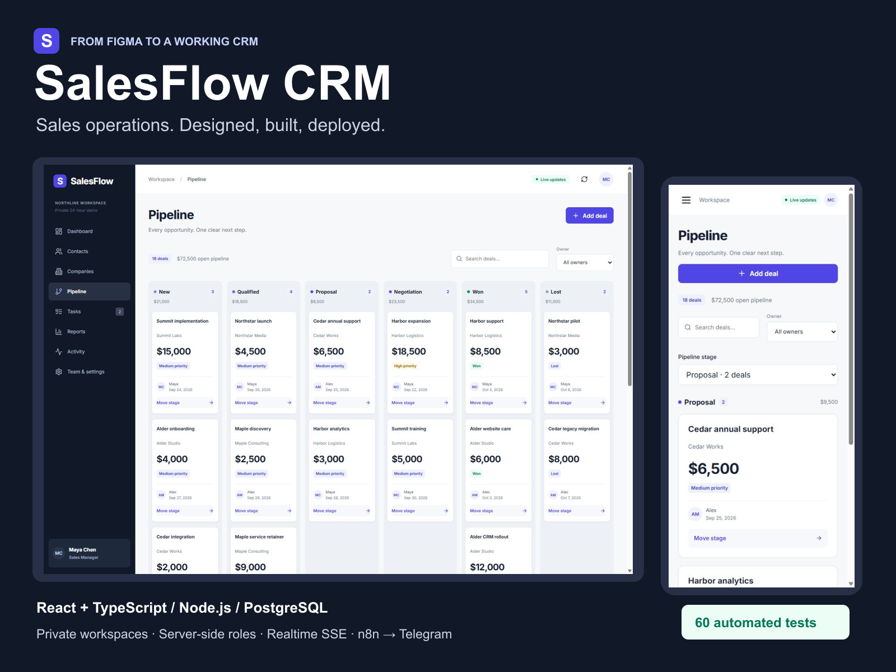
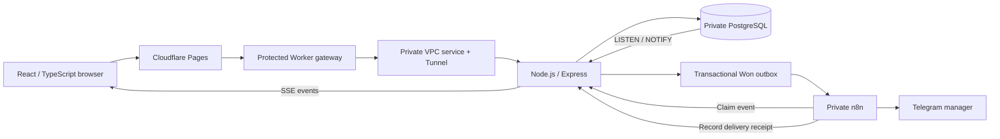

# SalesFlow CRM

**A working sales operations demo, designed in Figma and implemented end to end.**

[Live demo](https://salesflow-crm-demo.pages.dev/) · [Figma design](https://www.figma.com/design/tHCwZwV8Mv5jjPOOVf4UPG/SalesFlow-CRM--Portfolio-Design) · [Clickable prototype](https://www.figma.com/proto/tHCwZwV8Mv5jjPOOVf4UPG/SalesFlow-CRM--Portfolio-Design?node-id=1-2&starting-point-node-id=1%3A2&scaling=min-zoom&page-id=0%3A1) · [Screenshots](media/README.md) · [API reference](docs/api.md)



SalesFlow connects contacts, companies, opportunities, tasks and sales activity in a focused CRM. Each visitor receives a private, seeded 24-hour workspace. PostgreSQL stores real changes, the API enforces role permissions, SSE shares committed updates across browser tabs, and a Won deal can trigger a real Telegram notification through an isolated n8n workflow.

This is a portfolio MVP with fictional data, not a commercial CRM subscription service. It demonstrates a complete business process → UX → Figma → design system → React → API → database → realtime → automation → deployment workflow.

## Business process

**Lead / Contact → Company → Deal → Pipeline Stage → Activities / Tasks → Won / Lost**

A contact starts as a lead and can be linked to an account. Opportunities reference a company, optional contact, owner, value, expected close and next action. Tasks identify the next conversation. Managers see the entire team; representatives work assigned records; viewers explore without changing data.

Useful metrics are computed from saved records: open pipeline value, open opportunities, wins, won revenue, closed-deal conversion, overdue tasks, upcoming tasks and stage/owner breakdowns. Conversion is **Won / (Won + Lost)**; open deals do not inflate it. There are no invented growth trends. See [business rules](docs/business-process.md).

## Figma design process and design system

The Figma structure was created before the React implementation, using the free Starter plan. The file contains a foundations sheet, ten desktop screens at 1440 px, five 390 px mobile adaptations and a stage confirmation. A clickable prototype covers role entry → dashboard → pipeline → deal → stage confirmation → return.

The small local design system covers colors, Inter typography, spacing, grids, radii, shadows and icon usage. Components include buttons, inputs, selects, search, textarea, checkbox, badges, avatars, KPI cards, table rows, empty states, modals, drawers, toasts, tabs, pipeline cards, task items and activity items, with relevant default/hover/disabled/error/loading/empty examples.

Native Figma foundations and dashboard are supplemented by editable vector/text screen assets imported into Figma before coding. These design specifications live in `design/screens`; real application captures are separately labeled in `media`. [Design decisions and Figma-to-production notes](docs/design.md).

## Figma → production

The production UI follows the dark navigation rail, indigo actions, white cards, neutral canvas, typography scale and responsive patterns defined in Figma. Static design values are replaced with real workspace data. Operational additions include validation, filtering, archive constraints, session information and actual notification status. Comparisons cover key desktop and mobile screens; this is an intentional implementation of the design, not a claim of 100% pixel identity.

## Architecture



- Frontend: React 19, TypeScript, Vite, responsive CSS, Lucide icons.
- API: Node.js 22, Express 5, Zod validation, Pino structured request logging.
- Database: PostgreSQL 17, foreign keys, check constraints, row-level security and transactions.
- Realtime: native EventSource/SSE plus PostgreSQL LISTEN/NOTIFY; no polling disguised as realtime.
- Automation: self-hosted n8n, authenticated webhook, atomic event claim and Telegram delivery receipts.
- Infrastructure: Cloudflare Pages, protected Worker, private Cloudflare Tunnel/VPC service, separate Docker services/networks/volumes.

## CRM domain model

`users`, `workspaces`, `workspace_members`, `sessions`, `pipeline_stages`, `companies`, `contacts`, `deals`, `tasks`, `notes`, `activities`, `automation_events` and schema migration metadata.

Composite foreign keys prevent cross-workspace references. Every workspace-scoped table uses PostgreSQL RLS; the application role is neither superuser nor an RLS-bypass role. Active contact emails are unique within a workspace. The same email can exist in another visitor's dataset.

### Pipeline and integrity

New → Qualified → Proposal → Negotiation → Won / Lost. An explicit stage dialog is used instead of drag-only controls, so the action works reliably on mobile and with a keyboard. Open stages can move in either direction. Lost requires a reason; terminal stages set `closed_at`; reopening clears closed metadata and requires a manager.

Stage updates, audit events and Won outbox insertion commit atomically. A monotonically increasing record version prevents lost updates: stale writes receive HTTP 409. Writes are serialized within the small demo workspace. Open deals cannot be archived; related open deals, active company contacts and incomplete linked tasks protect dependent records from unsafe archiving. Archived records retain their history.

## Roles and demo access

| Role | Read | Write |
|---|---|---|
| Sales Manager | Entire private workspace | All records, assignments, team profiles and stage changes |
| Sales Representative | Entire private workspace | Own assigned records, own tasks/notes; cannot assign another owner or reopen closed deals |
| Viewer | Entire private workspace | None |

One click creates a cryptographically random anonymous session with a hashed server-side token and a HttpOnly cookie (Secure in production). A deliberate **demo persona switch** lets visitors explore each role inside their own dataset. It is not production user authentication or an identity verification system. Tabs in the same browser share both workspace and persona. Separate browser profiles get separate workspaces.

Demo data expires after 24 hours and cleanup runs approximately once per minute. Only fictional details should be entered. OAuth is intentionally omitted from this MVP.

## Realtime

After a database commit, PostgreSQL NOTIFY publishes a small workspace event. The API delivers it over an authenticated same-origin SSE endpoint. The client refetches current state without a page reload. Reconnection performs a full state sync; this is not an unlimited historical event replay service.

SSE streams are scoped to the session's workspace, have heartbeats and connection limits, and close on expiry. In-progress form values remain intact; a conflicting save receives an explicit 409 instead of silently overwriting another tab.

## Automation

**Deal moved to Won → transaction / outbox → n8n claim → Telegram → stored receipt.**

The message includes fictional deal name, company, value, owner and close timestamp. A unique activity/outbox relationship and atomic queued-to-processing claim suppress duplicate deliveries for the same event. Reopening and winning a deal again is a new business event.

Webhook dispatch uses bounded retry/backoff only before an event is claimed. Telegram itself is not blindly retried. If a request's delivery cannot be confirmed, the UI reports **Delivery unconfirmed**; it does not pretend success or automatically send another copy. Receipt callbacks are idempotent. The CRM remains usable if n8n/Telegram is unavailable. This is practical duplicate protection with explicit ambiguity handling, not a promise of distributed exactly-once delivery.

Workflow source: [`n8n/workflow.mjs`](n8n/workflow.mjs). Credentials and manager chat configuration are supplied privately during deployment and are not included in this repository.

## Security

- Server-side authorization on every write; workspace-scoped queries and PostgreSQL RLS.
- Strict input schemas, valid calendar dates, nonnegative currency values and relation/ownership checks.
- 32 KB request limit, edge + API rate limiting, bounded records/notes/SSE connections per demo.
- Same-origin writes, CSRF token, HttpOnly session cookie, production Secure flag and safe JSON errors.
- Gateway removes untrusted privileged headers, adds the private origin secret and forwards only required headers.
- Public Worker development URLs are disabled; the backend, PostgreSQL and n8n have no public host ports in the production Compose configuration.
- SQL parameters, React text escaping and HTML escaping for Telegram message fields.
- Server-side secrets only; logs contain request metadata, not request bodies or session tokens.
- Separate containers, networks, volumes and resource limits; existing portfolio services are not modified.

## Tests and verification

The suite covers domain rules, UI behavior, gateway protection and **real PostgreSQL integration using a restricted application role**. Integration coverage includes two workspaces/RLS, contact/company CRUD, search/filter/pagination, server role permissions, stage transitions, invalid data, tasks/overdue counts, notes/activity, reports, concurrent conflicts, session restoration/logout, SSE and notification claim/receipt idempotency.

```sh
npm ci
npm test                    # Unit/frontend/gateway; PG suite skips without TEST_DATABASE_URL
npm run lint
npm run build
TEST_DATABASE_URL=postgres://.../salesflow_test npm test
```

The integration suite refuses a database whose name does not end in `_test` and asserts the role cannot bypass RLS. It creates and removes only its own temporary test workspaces. Verification results and browser checks are recorded in [`docs/verification.md`](docs/verification.md).

## Local setup

Use Node.js 22 LTS and PostgreSQL 17 (or Docker). Copy `.env.example` to `.env`, then set random local passwords and secrets. Never commit `.env` or reuse sample values in a deployment.

```sh
npm ci
docker compose --env-file .env up -d db
docker compose --env-file .env exec -T db psql -U postgres -d salesflow < server/schema.sql
docker compose --env-file .env exec -T db psql -U postgres -d salesflow < db/grants.sql
npm run dev:api
npm run dev                 # A second terminal; http://localhost:5173
```

Set `DATABASE_URL` to the local `salesflow_app` role on port 55481. The Vite proxy forwards `/api` to port 4600. `PUBLIC_ORIGIN` must match the browser origin exactly. Database creation uses the administrative role only for schema setup; normal API requests use the restricted app role.

## Docker and deployment

`compose.yaml` provides PostgreSQL, API and n8n. Local ports bind only to loopback. Apply `compose.production.yaml` to remove host ports, make the database network internal and add the private tunnel. Supply runtime variables and tunnel material in private files outside Git. Install the n8n workflow with private credential references and activate it. Schema changes and backend images are deployed explicitly; Pages frontend updates deploy from GitHub `main`.

Cloudflare Pages configuration:

| Setting | Value |
|---|---|
| Production branch | `main` |
| Build command | `npm run build` |
| Output directory | `dist` |
| Node.js | `22` |
| Service binding | `SALESFLOW_API` → `salesflow-crm-gateway` |

The Worker uses a private VPC service binding, edge rate limiter, `PUBLIC_ORIGIN` variable and `ORIGIN_SECRET` secret. All secrets belong in server/Cloudflare/n8n settings. `scripts/deploy-server.sh` documents the isolated host deployment; adapt its named paths to your own host. `scripts/test-postgres.sh` runs the real integration suite in a separate test database.

## Customization and limitations

Suitable as a starting point for sales teams, service businesses, B2B companies, agencies, account management, customer success, real estate and automotive workflows.

**Possible future integrations**, not connected here: HubSpot, Salesforce, Gmail, Outlook, Slack, WhatsApp, Google/Microsoft Calendar, Stripe and custom APIs.

This demo uses one currency (USD), a fixed six-stage pipeline, three fictional personas, bounded temporary data, one Won automation and a single API instance. It does not implement real user onboarding, OAuth, billing, email/calendar synchronization, arbitrary team invitations, import/export, multi-instance event replay, backups/HA or enterprise CRM processes. Telegram has an external delivery dependency and cannot guarantee delivery time. Free infrastructure quotas and server resources are finite. No paid service was added for this project.

## What this project demonstrates

Business process design · UI/UX · Figma · design systems · Figma-to-React · full-stack development · CRM logic · PostgreSQL · REST API · RBAC · realtime systems · workflow automation · testing · isolated production deployment.
