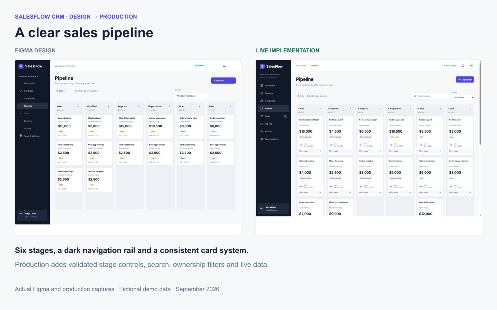
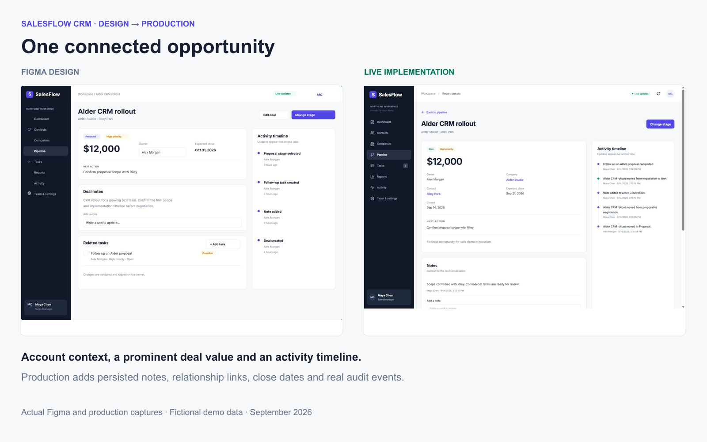
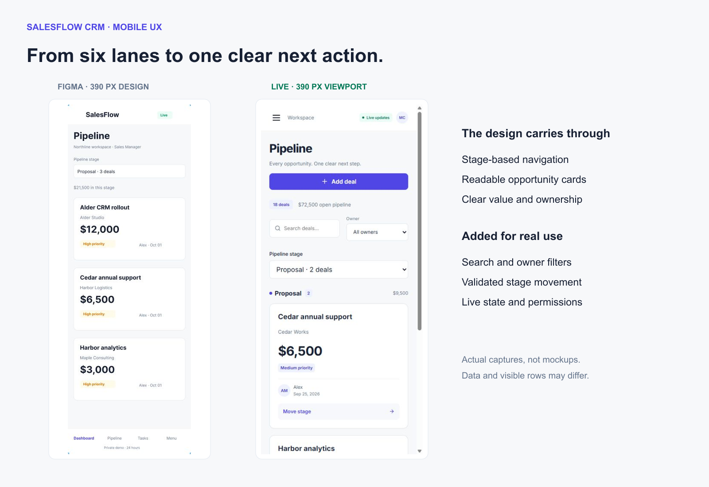

# SalesFlow CRM — portfolio media

These are actual captures of the public application and its editable Figma file, taken on September 14, 2026. All customer, company and deal details are fictional. The cover and comparison boards arrange these real captures with labels; they do not fabricate application states.

[Live demo](https://salesflow-crm-demo-7id.pages.dev/) · [Figma file](https://www.figma.com/design/tHCwZwV8Mv5jjPOOVf4UPG/SalesFlow-CRM--Portfolio-Design)

## Cover

`cover.png` is 1600 × 1200. Suggested portfolio title: **SalesFlow CRM | Figma, React, PostgreSQL, Realtime & Automation**.

## Eight primary screenshots

| Order | Capture | What it shows |
|---|---|---|
| 1 | [Figma design system](01-figma-design-system.png) | Real editable foundations, component families and states in Figma |
| 2 | [Dashboard](02-dashboard.png) | Live workspace metrics, pipeline and next actions |
| 3 | [Contacts](03-contacts.png) | Persisted fictional contact, companies, owners and statuses |
| 4 | [Deals pipeline](04-pipeline.png) | Six stages, opportunity values and stage controls |
| 5 | [Deal detail](05-deal-detail.png) | Won deal, linked account/contact, notes and committed activity |
| 6 | [Tasks](06-tasks.png) | Open, overdue, in-progress and completed tasks |
| 7 | [Reports and automation](07-reports-automation.png) | Actual report totals and confirmed Telegram delivery |
| 8 | [Architecture and business value](08-architecture.png) | Figma-to-production flow, deployed stack and honest customization options |

## Figma versus production

The design is a static specification; production shows actual saved data after the test scenario. Differences in deal stage, record order, dates, values and visible rows are expected. Production also adds real validation, filters, ownership controls, relationship links and delivery feedback. These boards demonstrate design correspondence, not pixel-identical reproduction.

## Additional mobile evidence

[Dashboard](mobile-dashboard.png) · [Contacts](mobile-contacts.png) · [Pipeline](mobile-pipeline.png) · [Deal detail](mobile-deal-detail.png) · [Tasks](mobile-tasks.png)

The mobile captures use a 390 px viewport. Responsive checks also covered 320, 768 and 1440 px. Images are viewport captures; longer pages continue below the visible area. Original cropped Figma captures are retained as `figma-pipeline.png`, `figma-deal-detail.png` and `figma-mobile-pipeline.png`.

For a short presentation, prioritize the cover, pipeline, deal detail, delivered automation and one Figma/production comparison. [Verification record](../docs/verification.md).
